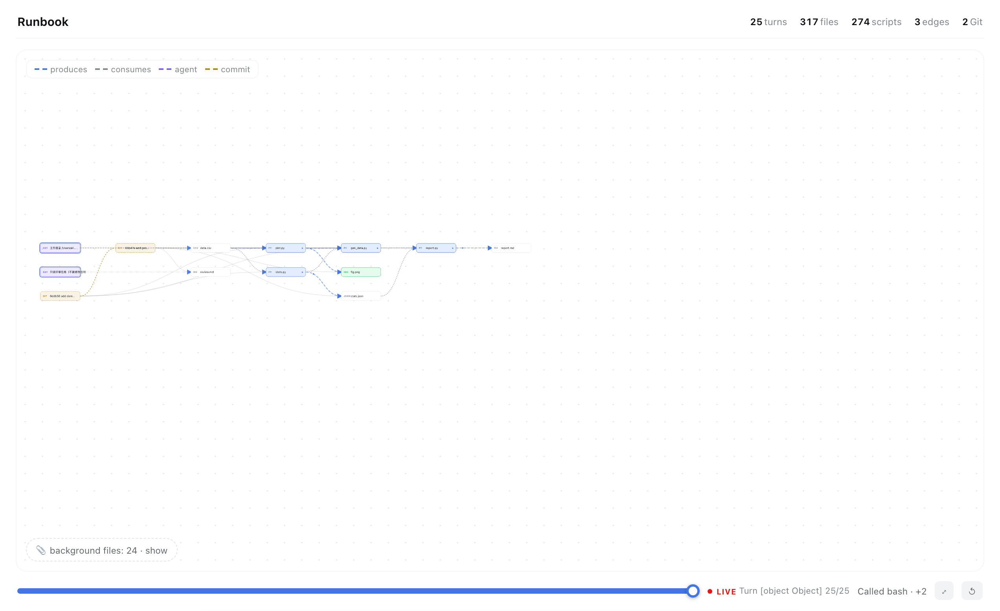

# dsh-plugin-runbook

**English** · [中文](#中文介绍)

> Turn any DeepSeek Harness (DSH) session into a live, scrubbable **data-flow runbook** — see everything your agent produced, how it connects, and rerun any step in one click.



## Why

You let an agent grind for hours. It touched 300 files, ran 50 commands, spawned subagents, committed to git — and at the end you're left asking: *what did it actually make, and how do the pieces fit?*

The chat transcript can't answer that. **A graph can.**

Runbook builds a Jupyter-notebook-style DAG of the whole session: scripts, datasets, figures, docs — every node a real file, every edge real data flow. Scrub the turn slider and watch the pipeline **grow like a tree**. Hover a node for one-click **preview / rerun / LLM-explain**. Git history becomes provenance nodes; subagent work gets stitched in; a persistent ledger survives compaction and restarts.

## Feature highlights

| | |
|---|---|
| 🔀 **Turn scrubber** | Drag from turn 1 to now — the graph grows structurally (zoom/pan stay live, no canned animation) |
| 🖥 **Mini terminal** | Click ▶ on any script: a small corner terminal streams stdout/stderr + exit code — page never hijacked |
| ✨ **LLM explain** | One sentence on what any file *is* and where it came from; racing primary × fallback models, 2–6 s typical |
| 📜 **Git provenance** | Commits are first-class nodes chained in time; files hang off their commit — un-pushed history gets structure too |
| 🤖 **Subagent stitching** | Child-session runs/edits/reads mined from their own logs; agent→script→artifact edges, purple-coded |
| 💾 **Disk scan + static IO** | Never-ran, never-committed research code still enters the graph: `read_csv/to_csv/savefig` + CLI-flag adjacency + mtime inference |
| 📖 **PIPELINE.md backbone** | Got a curated mermaid pipeline doc? It becomes the view. Missing files render as dashed ghosts — your gap list, visualized. No doc? A zero-API backbone is inferred from static IO |
| 🧹 **Shelf** | Orphan files collapse into a per-directory tray by default — the pipeline stays the hero |
| 🌐 **Global retarget** | Type any project path in the header; git/scan/backbone all retarget, persisted across sessions |

All local by default. The only optional network call is ✨ explain, through your configured provider.

## Install

```bash
dsh plugin --profile web add zhan-tz/dsh-plugin-runbook
```

Open any conversation → **Runbook** tab. For the backbone view, drop a `PIPELINE.md` (mermaid `flowchart LR` + status emoji) in your project root — or just let it infer one.

## How it works

```
session timeline ──┐
git ledger ────────┼──► buildFileGraph ──► layered layout ──► SVG (scrub/zoom/hover)
subagent logs ─────┤         ▲
persistent ledger ─┤         └─ host routes (zstd, regex, static IO, cycle guards)
disk scan ─────────┘
```

Host (`lib/index.js`) exposes local routes: `/agent-fileview` `/agent-explain` `/agent-run` `/agent-git` `/agent-subruns` `/agent-ledger` `/agent-scan` `/agent-pipeline`. Client (`lib/client.js`) rebuilds the graph and renders it. See [ROADMAP.md](ROADMAP.md) for the layered architecture and what's next.

## Honest limits

- ✨ fallback model can take ~30 s on very long prompts (a live seconds counter shows it's working)
- The ledger preserves edges **from install time**; earlier history relies on git commit nodes
- Repos > 60 commits are mined by the most recent 60

## Community

Part of the [DSH plugin](https://github.com/topics/dsh-plugin) ecosystem. Feedback, issues and PRs welcome — especially pipeline-doc variants from other fields (the mermaid parser is deliberately lenient).

**Keywords**: dsh plugin, DeepSeek Harness, agent artifacts, provenance, data lineage, pipeline DAG, workflow visualization, reproducibility, Jupyter-style, research notebook, agent observability, multi-agent.

---

## 中文介绍

**DSH 插件：把任何 agent 会话变成可回放、可复跑的数据流运行本。**

agent 干了几小时活，碰了 300 个文件、跑了 50 条命令、起了子 agent、提交了 git——聊天记录回答不了"它到底做出了什么、怎么串起来的"。**图能。**

- **回合滑杆**：从第一回合拖到现在，流水线像树一样长出来（缩放平移全程可用）
- **小终端**：任意脚本上点 ▶，右下角小终端流出 stdout/stderr + 退出码，不劫持页面
- **悬停动作**：👁 预览 / ▶ 重跑 / ✨ 一句话解释（主备模型竞速，通常 2–6 秒）
- **git 出处节点**：提交成链、文件挂靠——没推送的历史也有结构
- **子 agent 缝合**：子会话日志挖掘，agent→脚本→产物紫色边
- **磁盘扫描 + 静态 IO**：没跑过没提交的研究代码照样进图（`read_csv`/旗标邻接/mtime 三层推断）
- **PIPELINE.md 主链**：有 mermaid 流程文档就以它为骨架，缺失文件渲染为幽灵节点；没有文档就零 API 自动推断
- **孤儿收纳**：默认收起按目录分组，主流水线永远是主角

安装：

```bash
dsh plugin --profile web add zhan-tz/dsh-plugin-runbook
```

## License

MIT
